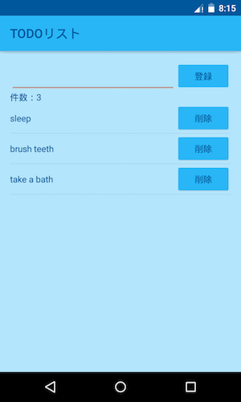

# android-rxjava-app-sample

## Use library

- [Dagger 2 (ver 2.0.2)](https://github.com/google/dagger)
- [RxJava (ver 1.1.0)](https://github.com/ReactiveX/RxJava)
- [RxAndroid (ver 1.1.0)](https://github.com/ReactiveX/RxAndroid)
- [Gradle Retrolambda Plugin (ver 3.2.5)](https://github.com/evant/gradle-retrolambda)
- [Android Orma (ver 2.0.6)](https://github.com/gfx/Android-Orma)
- [Butter Knife (ver 7.0.1)](https://github.com/JakeWharton/butterknife)
- [Stetho (ver 1.2.0)](https://github.com/facebook/stetho)
- [android-apt (ver 1.8)](https://bitbucket.org/hvisser/android-apt)

> This project uses Java 8 and [Retrolambda](https://github.com/orfjackal/retrolambda).

## License

MIT
